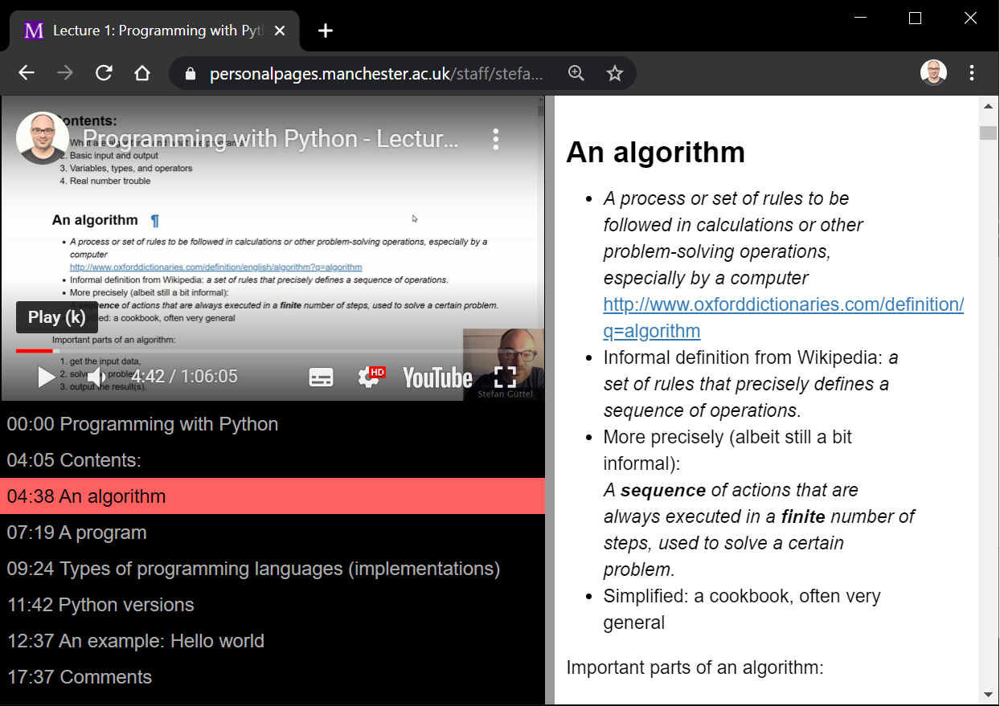

# split-lecture

**split-lecture** is a simple tool to show YouTube videos alongside Jupyter Notebooks and keep them synchronised. It has been built to support blended learning for a Python programming course delivered at the University of Manchester. 

[**View an example lecture**](https://personalpages.manchester.ac.uk/staff/stefan.guettel/split-lecture/)

# Setup

**split-lecture** is written in JavaScript and very easy to set up. Simply follow the below steps:

1. On your webserver, create a new folder.
2. In this folder, place your Jupyter Notebook file as an HTML export. (In Jupter, view the notebook and go to File -> Download as -> html to produce this HTML file.)
3. In that same folder, place the files `index.html` and `custom.css` from the repository.
4. Open `index.html` and edit lines 11-37 as follows:
   * line 11: insert the title of your lecture
   * line 13: change the value of `notebookUrl` to the name the exported HTML file from step 2. 
   * line 14: change the value of `ytVideoId` to the id of your YouTube video. Example: If your video URL is https://www.youtube.com/watch?v=yZH74R58h40, then the id is `yZH74R58h40`
   * line 15ff: change the timestamps and link names so that they coincide with the timings in the YouTube video and the anchor links in the exported HTML file from step 2. In order to obtain the anchor links, simply hover over a heading in the HTML file and read off the URL part following the `#` symbol.

That's it. I hope you find **split-lecture** useful for your teaching. Feel free to modify it to your needs. 

Any comments and feedback are appreciated, either by raising them as *issues* or dropping me an email: stefan.guettel@manchester.ac.uk
